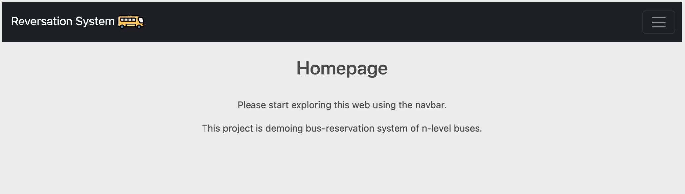
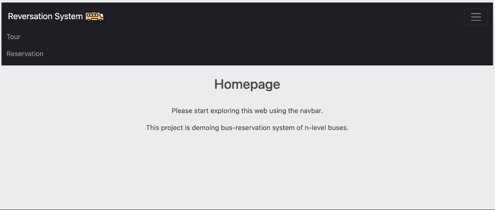
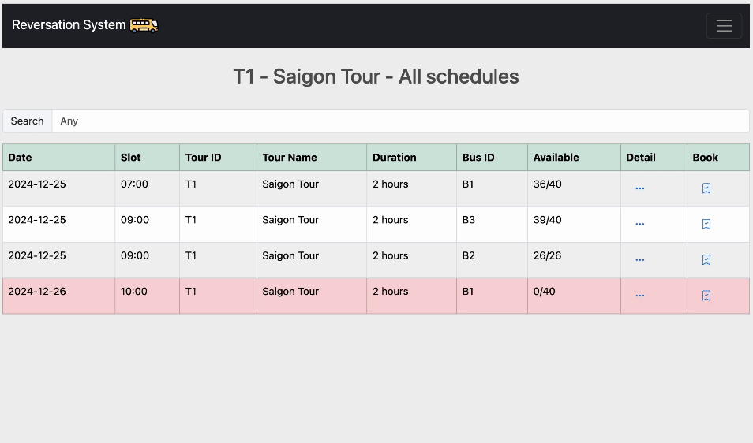
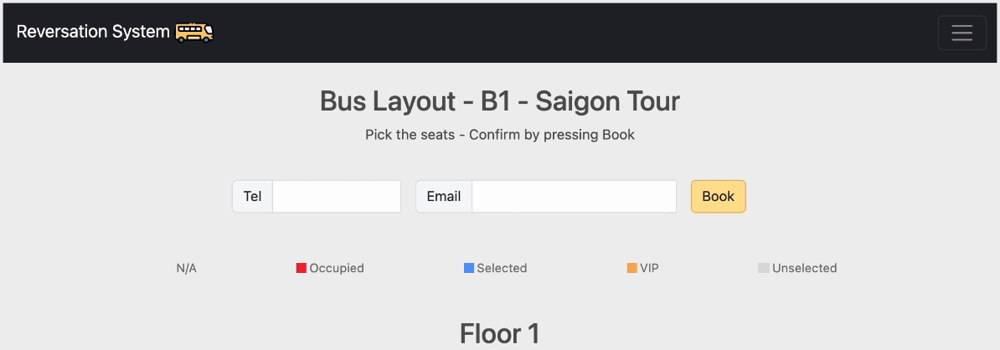
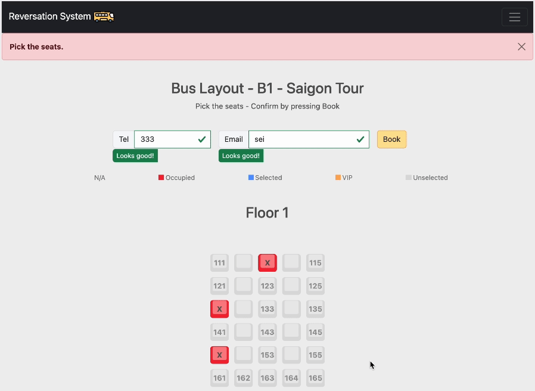
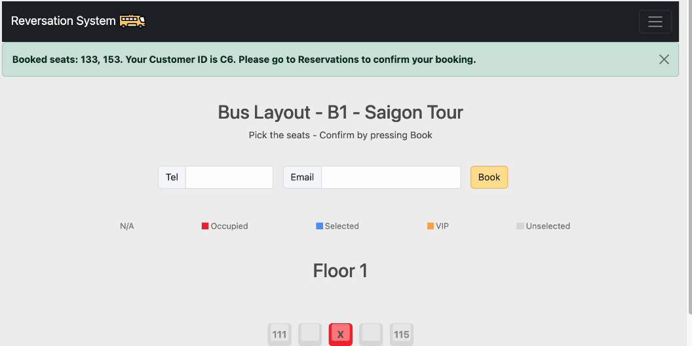
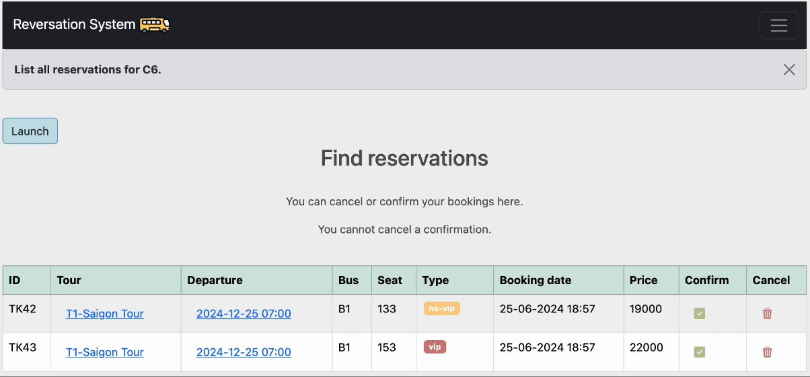

# The N-Level Bus Reservation System

### Table of Contents
**[Tech Stack](#Tech-Stack)**<br>
**[Execution](#Execution)**<br>
**[Demo](#Features)**<br>
**[References](#References)**<br>

### Overview
A web application that's designed to the manage booking and cancellation of bus reservations.

### Tech-Stack

* **Current**
  
  * **Frontend**: HTML/ CSS + Bootstrap 5
  
  * **Backend**: FastAPI
  
  * **Database**: MongoDB
 
* **Commit 8aa122f and before**

  * **Frontend**: HTML/ CSS
  
  * **Backend**: Flask
  
  * **Database**: JSON text file

### Execution

* Setup virtual environment

* Startup MongoDB server

  ```
  https://www.mongodb.com/docs/manual/administration/install-community/
  ```

* Libraries Installation
  
  ```
  pip install -r requirements.txt
  ```

* Go to `.env` file, replace `USR` and `PWD`

  ```
  USR=<your username>
  PWD=<your password>
  HOST=localhost:27017
  DB_NAME=bus_reservation
  ```
  Upon running application, it will automatically load the demo data to your database under `bus_reservation`

<br>

* Run program

  ```
  make
  ```

### Features

* `Homepage`:
  
  * Root `/`
    
  * Connect to `Tour` or `Reservation` via navbar
 
 <p align='center'>
  
 </p>

<br>
 
* `Tour`:
  
  * List all ongoing tours
      
    * `See schedules`: List all schedules of a particular tour
    
    * `Schedule Detail`
      
    * `Book now`
      
  * Search bar
    
  <p align='center'>
    
  </p>

 * `Schedule Detail`:

   *  Detailed information about a tour at a particular schedule
  
   * `Book now`
     
   * `Tickets Availability`: sold | processing | available
   
   * `Employees`: name | role | contact

      
  <p align='center'>
    
  </p>

   * `Bookings`:

     * pick seats and make reservations, show bus layout that reflect `Tickets Availability` correctly
    
     * Required for success booking:
    
        * Must fill in email/ telephone (no verification here)
     
        * Pick at least 1 seat
    
     * `Form validation`
    
     <p align='center'>
        
     </p>
       
     * `Pick seats`

     <p align='center'>
        
     </p>

     * After a success booking
       * `Customer ID`: is per (Email, Telephone)
       * Ticket is `Processing`: booked and wait for confirmations
       * Booked tickets are listed in `Reservations`, search by `CustomerID`
      
  * `Reservation`:

     * Find all reservations (tickets) for a particular customer id

     <p align='center'>
        
     </p>
    
     * `Confirm` or `Cancel` booking
         
       * If `Confirm`:
         
          * Tickets/ Seats is `Sold`
            
          * Confirmed tickets can't be `Cancel`led
      
       * If `Cancel`:
          * Ticket is deleted, seats become `Available`
    
     <p align='center'>
        
     </p>
    
### References

mongodb startup https://www.mongodb.com/docs/manual/administration/install-community/

bootstrap 5 https://getbootstrap.com/docs/5.0/getting-started/introduction/

https://www.w3schools.com/bootstrap5/index.php

https://icons.getbootstrap.com/

fastapi https://fastapi.tiangolo.com/tutorial/

https://fastapi.tiangolo.com/tutorial/bigger-applications/

https://github.com/tiangolo/fastapi/issues/5588

https://stackoverflow.com/questions/60127234/how-to-use-a-pydantic-model-with-form-data-in-fastapi/77113651#77113651

pydantic https://docs.pydantic.dev/2.0/usage/validators/

pymongo https:stackoverflow.com/questions/45732838/authentication-failed-to-connect-to-mongodb-using-pymongo

https://www.mongodb.com/resources/languages/pymongo-tutorial

avatar https://www.flaticon.com/free-icon/bus_5030991 

datetime css https://codepen.io/herteleo/pen/LraqoZ */

color palettes https://www.color-hex.com/color-palettes/

mov to gif https://www.adobe.com/express/feature/video/convert/mov-to-gif

