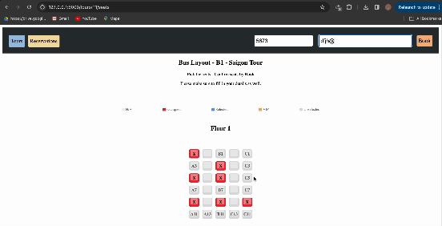

# Hệ thống bán vé cho xe khách (n tầng)

## Table of Contents
**[ERM](#ERM)**<br>

## ERM

* 8 Thực thể

  * Phương tiện - Chỗ ngồi - Khách hàng - Vé         
  * Chuyến đi - Tuyến đường - Nhân viên - Trạm dừng 

* Quan hệ và số lượng bản thể

  * Mỗi `khách hàng` có thể <đặt trước> 1 hoặc nhiều `vé`.
  * Mỗi `khách hàng` có thể <đặt trước> 1 hoặc nhiều `chỗ ngồi`.
  * Mỗi `chỗ ngồi` <thuộc> chỉ 1 `phương tiện`
  * Mỗi `phương tiện` có thể có 1 hoặc nhiều `chỗ ngồi`.
  * Mỗi `vé` <thuộc> chỉ 1 `chuyến đi`.
  * Mỗi `chuyến đi` có thể có 0 hoặc nhiều `vé`.
  * Mỗi `chuyến đi` được <phụ trách bởi> 1 hoặc nhiều `nhân viên`.
  * Mỗi `nhân viên` phụ trách 1 hoặc nhiều `chuyến đi`.
  * Mỗi `chuyến đi` <đi qua> 1 hoặc nhiều `tuyến đường`.
  * Mỗi `tuyến đường` có thể được đi qua bởi 0 hoặc nhiều chuyến đi.
  * Mỗi `tuyến đường` có thể <bao gồm> 1 hoặc nhiều `trạm dừng`.
  * Mỗi `trạm dừng` có thể được ghé bởi 0 hoặc nhiều `tuyến đường`.

<p align='center'>
  
</p>

## Tổ chức dữ liệu dưới dạng JSON

* Các tệp dữ liệu `*.json` nằm trong thư mục `/jsondata`
## Code Python

### Tải thư viện

```
  pip install flask
```

```
  pip install flask_socketio
```

### Chạy chương trình

`cd` vào `SE1003-BTVN-3`:


```
  python3 run.py
```
### Lỗi: Access to 127.0.0.1 was denied

Vào đường dẫn:

```
  chrome://net-internals/#sockets
```

Nhấn `Flush socket pools`

### Mô tả chức năng

* Homepage:
  * Không có gì, chỉ dùng để định nghĩa đường dẫn `/`
  * Dùng `header` để di chuyển qua [Tours] hoặc [Reservations]
 
 <p align='center'>
  
</p>
 
* Tours:
  * Dùng để liệt kê tất cả các chuyến đi (tours)
  * Có thể trực tiếp di chuyển qua:
    * [Book now] để đặt vé
    * [More] để xem thông tin chi tiết về chuyến đi này
  * Có thể sử dụng thanh tìm kiếm để tìm chuyến đi (tìm theo tên)
 
<p align='center'>
  
</p>
 
* Bookings: [Book_now]
  * Lưu ý: Nếu không điền đủ email + sđt, hoặc không chọn ghế nào thì không thể đặt vé. Sẽ có thông báo hiển thị.
  * Sau khi chọn ghế và đặt vé:
    * Người dùng sẽ được cấp mã người dùng.
    * Vé sẽ được coi là `Processing`: đã đặt và đang chờ xác nhận
   
<p align='center'>
  
</p>

<p align='center'>
  
</p>

<p align='center'>
  
</p>

* Reservations:
  * Dùng để liệt kê tất cả các vé xe đã đặt bởi 1 người dùng
  * Cần phải sử dụng thanh tìm kiếm để tìm những vé xe đã đặt (tìm theo mã người dùng được cấp)
  * Sau khi tìm kiếm vé bằng mã người dùng
    * Người dùng có thể chọn `Cancel` vé hoặc `Confirm` vé.

  * Nếu người dùng xác nhận vé bằng `Confirm`:
    * Vé sẽ được coi là `Sold`
  * Nếu người dùng huỷ vé bằng `Cancel`:
    * Vé sẽ bị xoá bỏ, chỗ ngồi trở về trạng thái `Available`

 <p align='center'>
  
</p>

* Lưu ý:
  * Mã người dùng:
    * Người dùng được coi là người dùng mới (được cấp mã mới) khi có (email, số điện thoại) độc nhất
 
  
