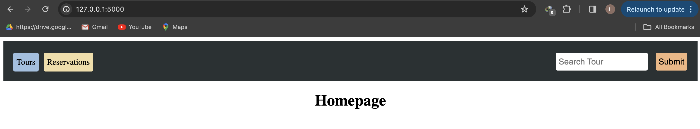
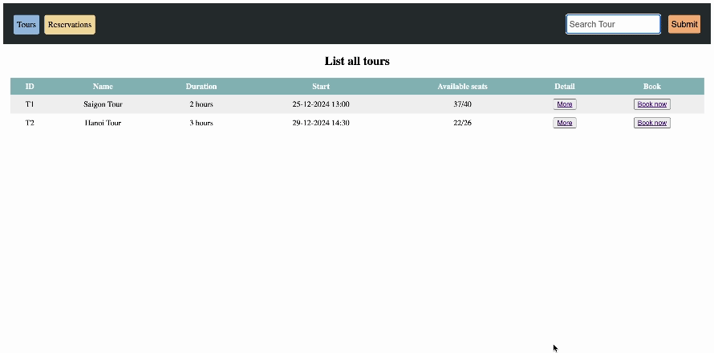
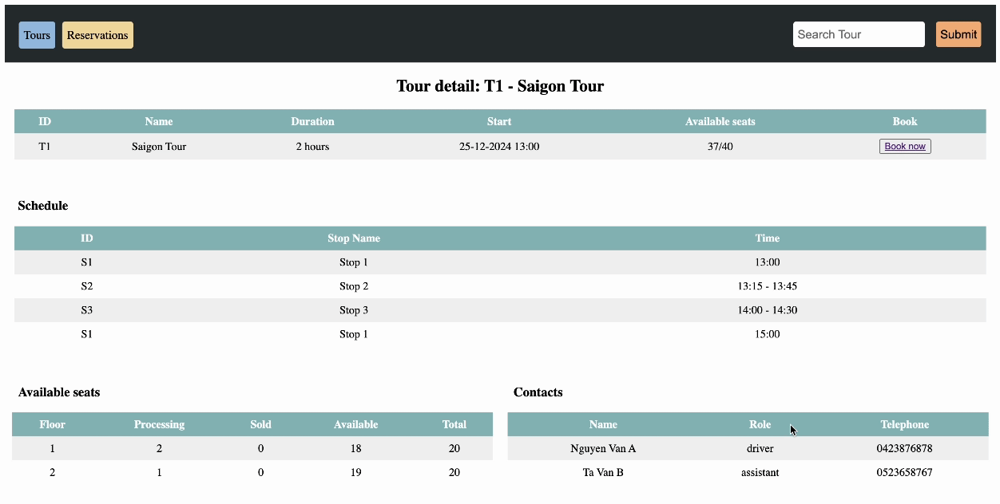
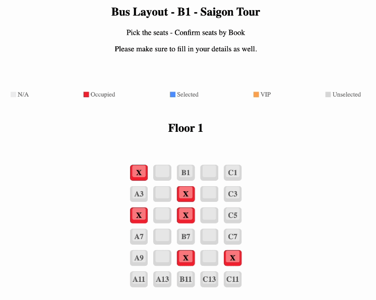
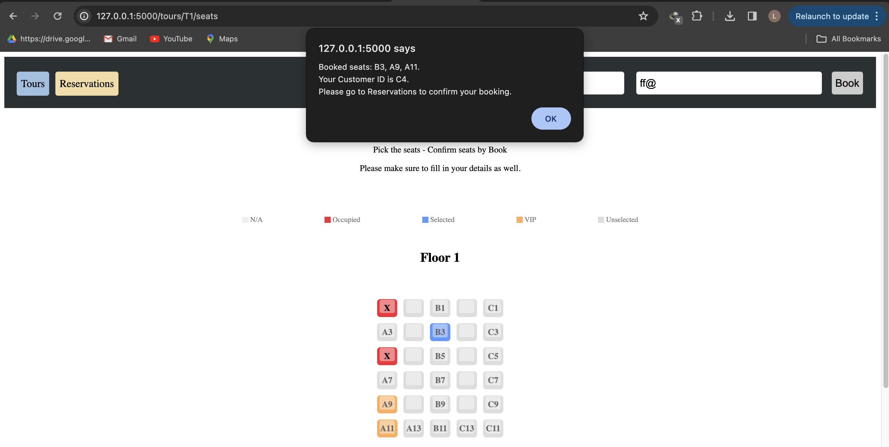
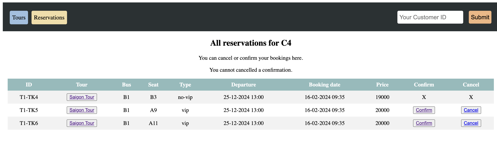

# Hệ thống bán vé cho xe khách (n tầng)

## Table of Contents
**[ERM](#ERM)**<br>

## ERM

* 8 Thực thể

  * Phương tiện - Chỗ ngồi - Khách hàng - Vé         
  * Chuyến đi - Tuyến đường - Nhân viên - Trạm dừng 

* Quan hệ và số lượng bản thể

  * Mỗi `khách hàng` có thể <đặt trước> 1 hoặc nhiều `vé`.
  * Mỗi `khách hàng` có thể <đặt trước> 1 hoặc nhiều `chỗ ngồi`.
  * Mỗi `chỗ ngồi` <thuộc> chỉ 1 `phương tiện`
  * Mỗi `phương tiện` có thể có 1 hoặc nhiều `chỗ ngồi`.
  * Mỗi `vé` <thuộc> chỉ 1 `chuyến đi`.
  * Mỗi `chuyến đi` có thể có 0 hoặc nhiều `vé`.
  * Mỗi `chuyến đi` được <phụ trách bởi> 1 hoặc nhiều `nhân viên`.
  * Mỗi `nhân viên` phụ trách 1 hoặc nhiều `chuyến đi`.
  * Mỗi `chuyến đi` <đi qua> 1 hoặc nhiều `tuyến đường`.
  * Mỗi `tuyến đường` có thể được đi qua bởi 0 hoặc nhiều chuyến đi.
  * Mỗi `tuyến đường` có thể <bao gồm> 1 hoặc nhiều `trạm dừng`.
  * Mỗi `trạm dừng` có thể được ghé bởi 0 hoặc nhiều `tuyến đường`.
 
```
 Nhấn vào hình để phóng to
```

<p align='center'>
  
</p>

<br>

## Tổ chức dữ liệu dưới dạng JSON

* Các tệp dữ liệu `*.json` nằm trong thư mục `/jsondata`

<br>

## Code Python

### Tải thư viện

```
  pip install flask
```

```
  pip install flask_socketio
```

### Chạy chương trình

* `cd` vào `SE1003-BTVN-3`:


```
  python3 run.py
```

### Xử lý ERROR 404: Access to 127.0.0.1 was denied

* Vào đường dẫn dưới đây:
  
  * Nhấn `Flush socket pools`

```
  chrome://net-internals/#sockets
```

### Mô tả chức năng

* `Homepage`:
  
  * Định nghĩa đường dẫn `/`
  * Dùng để di chuyển qua `[Tours]` hoặc `[Reservations]`
    
 
 <p align='center'>
  
</p>

<br>
 
* `Tours`:
  * Liệt kê tất cả các chuyến đi 
  * Có thể trực tiếp di chuyển qua:
 
    * `[More]` để xem thông tin chi tiết về 1 chuyến đi
      * Chi tiết bao gồm:
        
        * Thông tin về các nhân viên phụ trách
        * Thống kê tình trạng vé của xe (của từng tầng):
          
          * `sold` (đã bán)
          * `processing` (chờ xác nhận)
          * `available` (còn trống bao nhiêu)
          
    * `[Book now]` để đặt vé
    
  * Có thể sử dụng thanh tìm kiếm để tìm chuyến đi bằng tên
 
<p align='center'>
  
</p>

<br>

* `Bookings`
  
  * Điều kiện đặt vé thành công:
    
    * Điền đủ email + sđt (không kiểm tra tính hợp lệ)
    * Chọn ít nhất 1 ghế
      
  * Sau khi đặt vé thành công:
    
    * Người dùng sẽ được cấp mã KH
    * Người dùng được coi là người dùng mới (được cấp mã mới) khi có (email, số điện thoại) độc nhất
    * Vé sẽ được coi là `Processing`: đã đặt và đang chờ xác nhận
    * Người dùng có thể tra những vé đã đặt qua `[Reservations]` bằng mã KH qua thanh tìm kiếm
   
 
```
Giao diện đặt vé
```  
<p align='center'>
  
</p>

```
Chọn ghế
```
<p align='center'>
  
</p>

```
Đặt vé thành công
```
<p align='center'>
  
</p>

<br>

* `Reservations`:
  * Liệt kê tất cả các vé xe đã đặt bởi 1 người dùng
  * Cần phải sử dụng thanh tìm kiếm bằng mã KH được cấp
  * Sau khi tìm kiếm vé bằng mã KH
    * Người dùng có thể chọn `Cancel` vé hoặc `Confirm` vé.

  * Nếu người dùng xác nhận vé bằng `Confirm`:
    * Vé (chỗ ngồi) sẽ chuyển về trạng thái `Sold`
    * Vé đã xác nhận không thể huỷ vé bằng `Cancel`
      
  * Nếu người dùng huỷ vé bằng `Cancel`:
    * Vé sẽ bị xoá bỏ, chỗ ngồi trở về trạng thái `Available`

 <p align='center'>
  
</p>
 
  
